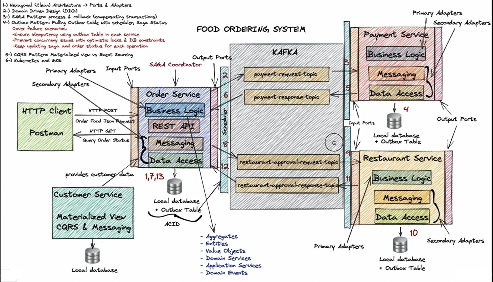
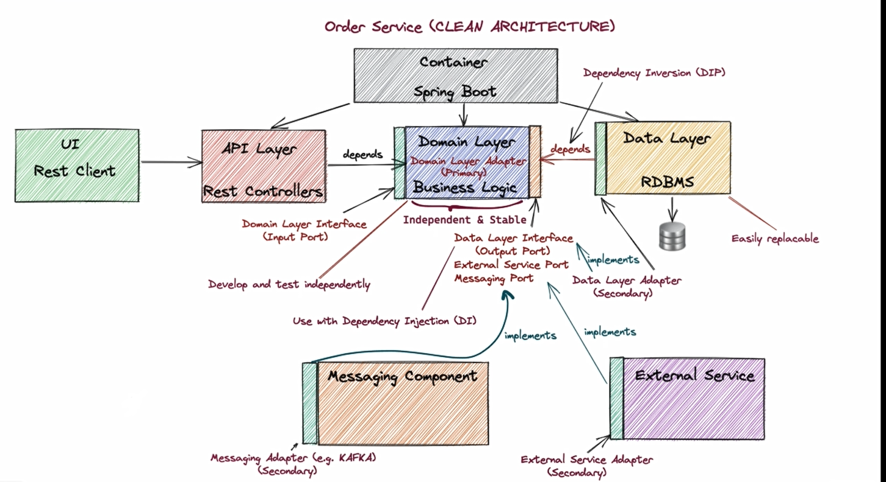
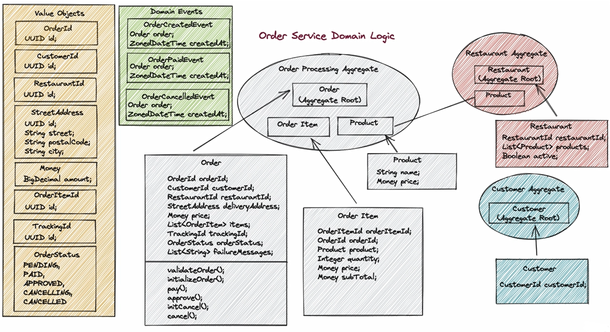
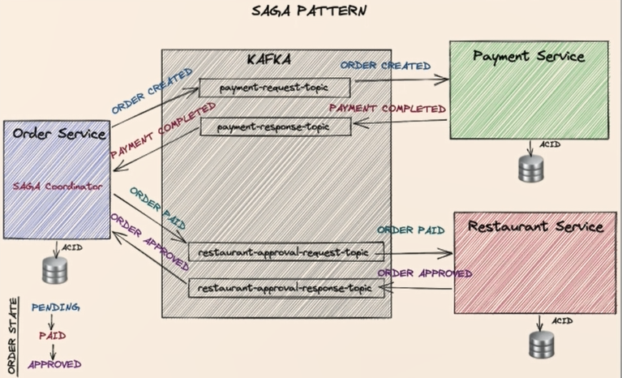
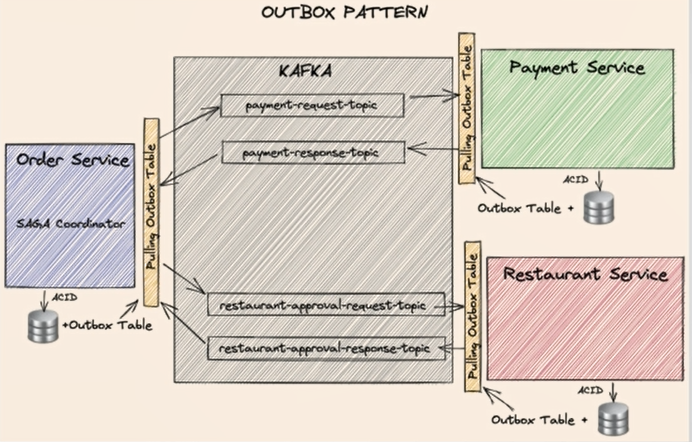
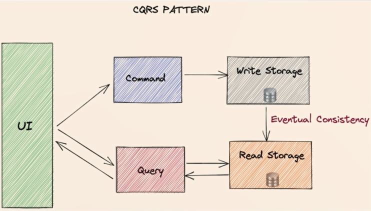
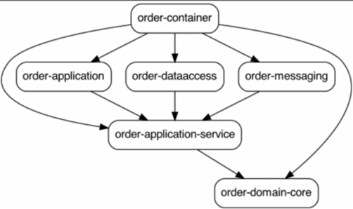

    

# Spring Boot microservices project based on udemy course

___

- Used Technologies:
    * Spring Boot
    * PostgreSQL
    * Hibernate
    * Kafka
    * Mockito
    * Maven
    * Docker
    * K8s
    * GKE
- Patterns
    - Hexagonal (Clean) Architecture:

      

        
      

    - DDD(Tactical):

      

        
      

    - SAGA (Orchestration):

      

        
      

    - OUTBOX:
  
      

        
      

  
    - CQRS:
  
      

        
      

    
    
- Maven modules:
 
    

        
    
